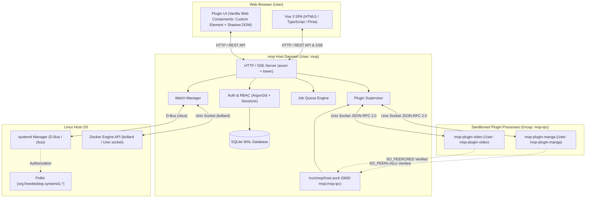

# mop (master-of-process)

**mop** は、ローカル Linux サーバーのためのセルフホスト型 Web 管理コンソールです。
systemd サービスや Docker コンテナの状態監視・ログ閲覧・操作、バックグラウンドジョブの実行、および拡張プラグインの管理を、ブラウザの統一されたモダンな UI から安全に行えます。

バックエンドは Rust (axum + tokio + SQLite WAL)、フロントエンドは Vue 3 SPA (TypeScript + Vite + Pinia) で構築され、Web アセットはバイナリに完全内包されているため、単一のデーモンとして容易に展開・運用できます。

---

## 主な機能

### 1. systemd サービス & Docker コンテナの監視と操作
- **Allowlist による厳格な管理対象制御**: 設定ファイル (`config.toml`) に明記されたサービス・コンテナ、または `mop.managed=true` ラベルを持つリソースのみを対象とします。
- **CLI サブプロセス呼び出しの排除**:
  - **systemd**: D-Bus (`zbus`) 経由で systemd Manager API を直接呼び出し、サービスのステータス取得・起動・停止・再起動・journald ログストリーミングを実施。Polkit による安全な権限昇格に対応。
  - **Docker**: Docker Engine API (`bollard`) 経由でコンテナの稼働状況・統計・再起動・ログ取得を実行。
- **ログの永続化を行わない設計**: ログ本文を DB やファイルに重複保存せず、journald および Docker logging driver からリアルタイムに直接取得します。

### 2. ユーザー管理と RBAC (ロールベースアクセス制御)
- **3 段階のロールモデル**:
  - `admin`: 全権限（ユーザー管理、プラグイン有効化・設定変更・バックアップ・リソース全操作）
  - `operator`: リソースの起動・停止・再起動、ジョブの実行・キャンセル
  - `viewer`: 状態およびログの閲覧のみ（読み取り専用）
- **セッション認証**: `axum-login` と `tower-sessions` による Cookie ベース認証。パスワードハッシュには `Argon2id` を採用。
- **監査ログ (Audit Logs)**: 状態変更、ジョブ投入、設定更新などの全操作を RFC 3339 形式のタイムスタンプとともに SQLite WAL データベースに永続化。

### 3. バックグラウンドジョブと SSE リアルタイム更新
- **非同期ジョブキュー**: 重い処理をキューイングし、並行ワーカー数制御、進捗率、ステータス遷移（`queued` → `running` → `completed` / `failed` / `canceled`）を管理。
- **Server-Sent Events (SSE)**: Web UI へのリソース状態、ジョブ進行度、ログ出力を低遅延でリアルタイム配信。

### 4. 強固に分離されたプラグイン基盤
- **プロセス分離**: プラグインは mop 本体とは別の専用システムユーザー (`mop-plugin-<id>`) で別プロセスとして起動。
- **Unix Domain Socket 通信**: 共有グループ `mop-ipc` (パーミッション `2770`) 配下のソケットを介し、双方向 JSON-RPC 2.0 で通信。
- **Capability 認可システム**: プラグインが必要とする権限（ファイルアクセス、ジョブ実行、ホスト通知等）をマニフェストで宣言し、管理者が明示的に承認。
- **設定ライフサイクル**: Save Draft（下書き保存）→ Diff プレビュー（差分確認）→ Apply Settings（安全な適用）の流れをサポート。
- **Web UI 拡張**: ホスト Vue に依存しない vanilla Web Components (Custom Element + Shadow DOM、`ui/index.js`) によるプラグイン専用画面の動的組み込み。

### 5. ファーストパーティプラグイン
- **`mop.manga` (旧 manga2cbz 移植)**:
  - 各種アーカイブ (ZIP, RAR, 7z, TAR) から WebP CBZ への一括変換
  - inotify (`notify`) と 2 秒デバウンスによるディレクトリ自動監視
  - WebP 仕様上限 (16383px) へのアスペクト比維持自動縮小
  - 作業ディレクトリ分離と中断時の自動クリーンアップ
- **`mop.video`**:
  - FFmpeg / libx265 による HEVC MP4 トランスコードジョブの実行管理

### 6. オンラインバックアップ / オフラインリストア
- **オンラインバックアップ**: SQLite の `sqlite3_backup` API を利用し、デーモン稼働中・WAL モード中でもロックを起こさず安全にスナップショットを取得。設定 (秘密情報マスク済み)、プラグインメタデータ、SHA-256 チェックサムを `.tar.zst` に圧縮アーカイブ。
- **オフラインリストア**: `mop.service` 停止チェック、チェックサム検証、マニフェストのスキーマ互換性確認を経て安全に復元。

---

## アーキテクチャ



---

## 必要なシステム依存

ビルドおよび実行に必要な依存パッケージ (Ubuntu 24.04 / Debian 12+):

```bash
# ビルド依存
sudo apt-get update
sudo apt-get install -y \
    build-essential \
    pkg-config \
    libsystemd-dev \
    libarchive-dev \
    libvips-dev \
    ffmpeg \
    libsqlite3-dev

# Rust ツールチェーン (stable)
curl --proto '=https' --tlsv1.2 -sSf https://sh.rustup.rs | sh

# Node.js (v22+) および pnpm
curl -fsSL https://deb.nodesource.com/setup_22.x | sudo -E bash -
sudo apt-get install -y nodejs
corepack enable && corepack prepare pnpm@latest --activate
```

---

## ビルド方法

### 1. フロントエンドのビルド
```bash
cd web
pnpm install
pnpm build
cd ..
```
成果物は `web/dist/` に出力され、バックエンドのバイナリに自動的に組み込まれます。

### 2. バックエンド & プラグインのビルド
```bash
# デバッグビルド
cargo build

# リリースビルド
cargo build --release
```
生成される主要バイナリ:
- `target/release/mop` (CLI およびサーバー本体)
- `target/release/mop-plugin-manga` (manga プラグイン)
- `target/release/mop-plugin-video` (video プラグイン)

---

## 実行方法

### 開発環境での実行
```bash
# サンプル設定から config.toml を準備
cp config.toml.example config.toml

# サーバー起動 (デフォルト: http://127.0.0.1:8787)
cargo run -p mop-cli -- serve --config config.toml
```
ブラウザで `http://127.0.0.1:8787` を開き、初期管理者ユーザー（Username / Password）を登録してログインします。

### 本番環境での実行 (パッケージインストール後)
Debian パッケージまたは tarball インストール後:
```bash
# サービスの起動と自動起動有効化
sudo systemctl enable --now mop.service

# サービス状態の確認
systemctl status mop.service
```

---

## テスト方法

```bash
# 1. Rust ワークスペース全テスト
cargo test --workspace

# 2. コードフォーマット & Clippy チェック
cargo fmt --check
cargo clippy --workspace -- -D warnings

# 3. フロントエンドの型チェック & 単体ビルド
cd web
pnpm typecheck
pnpm build
cd ..

# 4. Playwright E2E テスト
cd e2e
pnpm test
cd ..

# 5. パッケージ整合性スモークテスト
bash scripts/smoke-test-package.sh
```

---

## パッケージング

配布用パッケージの生成スクリプトを用意しています。

### 1. Debian パッケージ (.deb) の作成
```bash
bash scripts/build-deb.sh
```
`target/deb/` に以下の 3 パッケージが生成されます:
- `mop_<version>_<arch>.deb`: mop デーモン本体、Web UI、systemd ユニット、Polkit ルール、初期設定
- `mop-plugin-manga_<version>_<arch>.deb`: manga プラグインバイナリ、UI アセット、専用ユーザー設定
- `mop-plugin-video_<version>_<arch>.deb`: video プラグインバイナリ、UI アセット、専用ユーザー設定

### 2. スタンドアロン tarball の作成
```bash
bash scripts/build-tarball.sh
```
`target/tarball/` に `mop-<version>-linux-<arch>.tar.gz` が生成されます。
アーカイブ内にはバイナリ一式、プラグイン、設定サンプル、およびインストーラ `install.sh` / アンインストーラ `uninstall.sh` が同梱されます。

---

## セキュリティ設計の要点

mop はサーバー管理という特権的な領域を扱うため、以下の不変条件（SPEC §19）を厳格に遵守して設計されています。

1. **非 root 実行の徹底**: mop デーモンは専用ユーザー `mop`、各プラグインは専用ユーザー `mop-plugin-*` で動作します。root 権限での直接起動は許可されません。
2. **シェルコマンド実行の禁止**: `systemctl` や `docker` などの外部 CLI プロセスをサブシェルで起動することは一切ありません。すべて Linux D-Bus API (`zbus`) および Docker Engine Socket API (`bollard`) を型安全に呼び出します。
3. **Allowlist によるスコープ限定**: 設定ファイルで明示的に指定されていない unit / container に対する操作は API レベルで遮断されます。
4. **Origin 検証とレート制限**: 状態変更 API（POST/PUT/DELETE）には Origin ヘッダーの整合性検証および IP ごとのレートリミットが適用され、CSRF や総当たり攻撃を防止します。
5. **SO_PEERCRED による通知スプーフィング遮断**: プラグインからホストへの通知ソケット (`/run/mop/host.sock`) では、Linux カーネルの `SO_PEERCRED` を用いて送信元プロセスの UID/PID を取得・照合し、成りすましや未認可プロセスの通知を即座に破棄します。
6. **アーカイブ展開のパストラバーサル防御 (`safe_join`)**: アーカイブ展開処理において、Zip Slip（`../` による親ディレクトリ脱出）やシンボリックリンク攻撃を事前に検証して無効化します。

---

## リポジトリ構成

```
.
├── crates/
│   ├── mop-core/        # 共通ドメイン型、エラー定義、設定モデル
│   ├── mop-db/          # SQLite WAL 接続、マイグレーション、オンラインバックアップ
│   ├── mop-auth/        # Argon2id パスワード認証、セッション、RBAC
│   ├── mop-watch/       # systemd (D-Bus) & Docker (bollard) 監視・制御
│   ├── mop-jobs/        # 非同期ジョブキュー、並行制御
│   ├── mop-plugin/      # プラグイン supervisor、プロセス起動、JSON-RPC 2.0 クライアント
│   ├── mop-plugin-sdk/  # プラグイン開発用 SDK (RPC ヘルパー、ホスト通知クライアント)
│   ├── mop-http/        # axum REST API、SSE ストリーミング、認証・認可ミドルウェア
│   └── mop-cli/         # mop コマンドラインエントリポイント (serve, backup, polkit-rules 等)
├── plugins/
│   ├── manga/           # mop-plugin-manga (アーカイブ WebP CBZ 変換、ディレクトリ監視)
│   ├── video/           # mop-plugin-video (FFmpeg HEVC MP4 トランスコード)
│   ├── common/          # mop-plugin-common (プラグイン間共有クレート: safe_join, アーカイブ処理等)
│   └── hello/           # サンプルプラグイン
├── web/                 # Vue 3 + TypeScript + Vite + Pinia Web フロントエンド
├── e2e/                 # Playwright E2E テストスイート
├── deploy/              # systemd サービス定義、Polkit ルール、deb パッケージング設定
├── scripts/             # ビルド、パッケージング、スモークテスト用シェルスクリプト
└── docs/                # 詳細仕様書 (SPEC.md)、運用マニュアル、移行ガイド
```

---

## ライセンス

本プロジェクトは [MIT License](LICENSE) のもとで公開されています。
